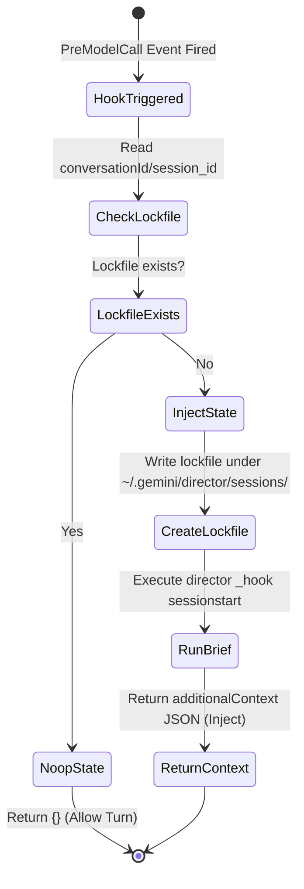

# Gemini / Antigravity Adapter Design: Hooks-Based Delivery Surface

Status: Designed and Proposed (July 7, 2026).

---

## 1. The Challenge

While **Gemini CLI** and **Google Antigravity CLI** are closely related, their native hook lifecycles differ:
* **Gemini CLI** natively supports a one-time `SessionStart` execution hook.
* **Antigravity CLI** does not have a `SessionStart` hook; its hook lifecycle consists of `PreModelCall`, `PreToolUse`, `PostToolUse`, `PostToolCallFinish`, and `Termination`.

To support the **push-based context injection** model on both platforms, Director uses a dual-wiring strategy using a stateful deduplicating shim for Antigravity's recurring hook events.

---

## 2. Implementation Overview

### A. Idempotent Hooks Installation
Wired via `director install --gemini` (or `--antigravity`):
* **Gemini CLI Wiring**: Merges `SessionStart`, `AfterTool`, and `SessionEnd` hooks into `~/.gemini/config/hooks.json`.
* **Antigravity CLI Wiring**: Merges `PreModelCall`, `PostToolUse`, and `Termination` hooks into `~/.gemini/antigravity-cli/hooks.json` (or workspace `.agents/hooks.json`).
* All entries are tagged with `_managedBy: "director"` for idempotent updates and clean uninstalls.

### B. Context Injection & Rehydration (Push Model)
Director automatically pushes context into the agent's session at startup:
1. **Gemini CLI (`SessionStart`)**: Directly executes `director _hook sessionstart`, returning the Charter and folded digest inside `hookSpecificOutput.additionalContext` to be injected once at startup.
2. **Antigravity CLI (`PreModelCall` with Stateful Shim)**: 
   * Since `PreModelCall` fires before *every* turn, the hook runner shim tracks session state using a local lockfile named after the session's `conversationId` (stored in `~/.gemini/director/sessions/<id>`).
   * On the **first invocation**, the shim writes the lockfile, executes the context retrieval, and returns the `additionalContext` payload.
   * On **subsequent invocations**, the shim detects the lockfile and immediately no-ops (returning `{}`), preventing context bloat and saving tokens.

#### Stateful Deduplication Flow (Antigravity)

### C. Session Wrap-up & Heartbeats
* **Stop / Termination Hook**: Triggers at the end of the session. Runs `director _hook stop` to perform the emit-guard validation (blocking or warning the agent if decisions/handoffs were made but not written to the log).
* **PostToolUse / AfterTool Hook**: Registers heartbeat liveness and updates fleet cockpit tracking after tool executions.

## 3. Downsides & Mitigations

Using a stateful lockfile-based deduplication system for the `PreModelCall` hook on Antigravity CLI introduces some operational risks, which are addressed as follows:

### A. Dangling Lockfiles & Disk Clutter
* **Risk**: If the terminal session is abruptly closed or the process is force-killed, the `Termination` hook never fires, leaving a dangling session lockfile behind.
* **Mitigation**: Lockfiles are uniquely named after the `conversationId` / `session_id`, meaning dangling files from past sessions will never affect new sessions. Additionally, Director implements a background garbage-collection (GC) mechanism inside hook execution that automatically purges files in `~/.gemini/director/sessions/` that are older than 24 hours.

### B. Session Resumes & Compactions
* **Risk**: On session resumes or prompt compactions, the `conversationId` remains unchanged, but the agent's context is partially reset or cleared by the runner. If the lockfile already exists, rehydration would be incorrectly skipped.
* **Mitigation**: The hook script inspects the incoming JSON payload's event metadata. If the event source is `"resume"` or `"compact"`, the shim automatically deletes the lockfile to force a new context injection.

### C. Concurrency Race Conditions
* **Risk**: If subagents are spawned concurrently or parallel tool calls trigger `PreModelCall` at the exact same millisecond, a simple check-and-write pattern could double-inject context.
* **Mitigation**: Lockfile creation uses atomic OS flags (`O_CREATE | O_EXCL`) to ensure lock acquisition is atomic and mutually exclusive.

### D. Process Spawning Overhead (Turn Latency)
* **Risk**: Spawning a shell subprocess on *every* turn to check the lockfile adds latency, which is particularly expensive on Windows machines.
* **Mitigation**: The Go shim executes and exits in under 1ms when it detects a lockfile. Additionally, the native Windows installation guard prevents running on Windows systems where process creation overhead is most severe.

---

## 4. Code References & Symbols

* **CLI Routing & Flags**:
  * [cmd/director/installcmd.go](file:///home/mlhamel/src/github.com/mlhamel/director/cmd/director/installcmd.go): Add `--gemini` and `--antigravity` flags, routing them to the Gemini hook installer.
* **Installer Logic**:
  * [internal/install/gemini.go](file:///home/mlhamel/src/github.com/mlhamel/director/internal/install/gemini.go): Implements `InstallGemini` and `UninstallGemini` to handle merging of the hooks into `hooks.json` and dropping the skills under `skills/`.
* **Stateful Deduplicator**:
  * [internal/hook/adapter.go](file:///home/mlhamel/src/github.com/mlhamel/director/internal/hook/adapter.go): Implements lockfile-based deduplication for the `PreModelCall` hook to support one-time push injection on Antigravity.

---

## 5. References

* [Antigravity Hooks Documentation](https://antigravity.google/docs/hooks)
* [Gemini CLI Hooks Documentation](https://geminicli.com/docs/hooks/)
